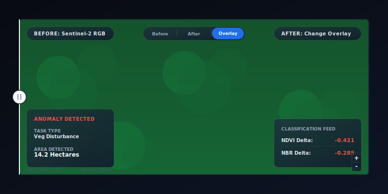
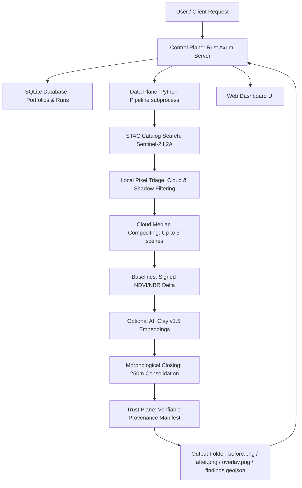

# Oberon

**Open, self-hostable Earth observation monitoring engine.**


<p align="center">
  
</p>

Oberon turns public satellite imagery (Sentinel-2 L2A) into ranked, evidence-backed change findings for defined land portfolios. Users supply an area of interest (AOI) and before/after time windows. Oberon returns ranked change polygons, spectral evidence, comparative imagery, and full provenance for every finding.

> [!IMPORTANT]
> **New to Oberon?** Start with the [Getting Started Guide](docs/GETTING_STARTED.md) — three paths: CLI (zero cost), API server (self-hosted), or Docker containerization.

---

## Why Oberon?

Existing Earth observation (EO) tools either dump raw imagery (requiring extensive manual analysis) or lock change detection behind opaque, expensive proprietary APIs. Oberon represents the middle path:

* **Zero Marginal Cost**: Run Oberon on standard cloud or local infrastructure, ingesting Sentinel-2 imagery via free, public STAC catalogs.
* **Deterministic by Default**: Spectral baselines (NDVI, NBR, NDMI) are the primary indicators of disturbance. No black-box dependency for core compliance workflows.
* **Optional AI Triage**: Clay v1.5 foundation model embeddings run as a parallel branch, scoring change metrics alongside deterministic indices.
* **Abstention over Guesswork**: When inputs are poor (dense cloud cover, missing pixels), Oberon explicitly abstains instead of producing false change detections.
* **Provenance is Product Data**: Every finding includes a verifiable `provenance.json` recording source scenes, bands, processing configs, software versions, and artifact paths.

### Product Matrix

| Capability | Raw STAC / Copernicus | Closed Proprietary SaaS | Oberon (Self-Hosted OSS) |
|---|---|---|---|
| **Deployment Model** | Web portal / manual download | SaaS API only | **Local, Docker, Cloud Instance** |
| **Privacy & Security** | Data queries sent to public portals | Data must be uploaded to vendor | **Zero Telemetry** (100% local processing) |
| **Scene Selection** | Manual tile-level filtering | Automated (opaque) | **AOI Bounding Box Triage** (ranks by cloud cover only over the polygon) |
| **Cloud Mitigation** | Manual inspection | Paid composite rendering | **Automatic Median Compositing** (merges up to 3 scenes per period) |
| **Seasonality Check** | False flags in autumn/winter | Proprietary custom tuning | **Spatial-Variance Seasonality Filtering** (separates leaf-fall from real forest loss) |
| **Human Verification** | None | Ad-hoc GIS software | **Integrated Dashboard Review Loop** (Approve/Reject controls) |

---

## Architecture Flow

Oberon separates data processing from client management using a modular four-plane model:



See [docs/ARCHITECTURE.md](docs/ARCHITECTURE.md) for the full system design.

---

## Getting Started

### Prerequisites
* Python 3.12+
* [uv](https://docs.astral.sh/uv/) package manager
* GDAL system libraries (macOS: `brew install gdal`, Ubuntu: `sudo apt install libgdal-dev`)
* Rust toolchain (optional, for compiling the server local binary)
* Docker (optional, for containerized server deployments)

### 1. Initialize and Check Setup
```bash
git clone https://github.com/farzin/oberon.git
cd oberon
uv sync
uv run oberon init
```

### 2. Path A: CLI Mode (Ad-Hoc Analysis)
Analyze a local GeoJSON polygon between two time windows and write output files directly to disk:
```bash
uv run oberon analyze \
  --aoi sample-aoi.geojson \
  --before-start 2024-01-01 --before 2024-03-01 \
  --after-start 2024-07-01 --after 2024-09-01 \
  -o output/
```
Outputs in `output/`:
* `before.png`, `after.png`, `overlay.png` — RGB imagery + visual change overlay
* `findings.geojson` — ranked change polygons with NDVI/NBR metrics
* `provenance.json` — metadata manifest linking scenes, configurations, and versions

### 3. Path B: Self-Hosted Server (Web Dashboard & API)
For multi-polygon portfolios, API integrations, and human-in-the-loop validation:
```bash
# Build and run the server locally (using sqlite state & background task queues)
cd control-plane && cargo build --release
OBERON_AUTH_DISABLED=1 ./target/release/oberon-control-plane serve --host 0.0.0.0:8000
```
Open [http://localhost:8000/](http://localhost:8000/) in your browser to access the Web Dashboard UI.

---

## Advanced Configurations

<details>
<summary><b>Docker Deployment</b></summary>

Build and run both the Rust control plane and Python pipeline in a single container:
```bash
# CPU Server
docker compose --profile server up -d

# GPU Server (requires Nvidia container toolkit)
docker compose --profile server-gpu up -d
```
</details>

<details>
<summary><b>Database API Key Security</b></summary>

For production deployments, authentication should be enabled. Generate a secure SHA-256 API key:
```bash
./target/release/oberon-control-plane auth create-key --user "organization-administrator"
```
Provide this key in the `X-API-Key` header for REST requests.
</details>

<details>
<summary><b>System Environment Variables</b></summary>

| Variable | Default | Description |
|---|---|---|
| `OBERON_STAC_URL` | `https://earth-search.aws.element84.com/v1` | STAC catalog endpoint |
| `OBERON_STAC_TIMEOUT` | `30` | STAC API connection timeout (seconds) |
| `OBERON_STAC_RETRIES` | `3` | Max retry attempts for STAC failures |
| `OBERON_COG_TIMEOUT` | `60` | GDAL HTTP timeout for COG reads (seconds) |
| `OBERON_COG_RETRIES` | `3` | GDAL HTTP max retries for COG reads |
| `OBERON_OUTPUT_DIR` | `~/.oberon/output` | Base output directory for analysis runs |
| `OBERON_DB_PATH` | `~/.oberon/oberon.db` | Path to SQLite database file |
| `OBERON_LOG_FORMAT` | `console` | Logging format (`console` or `json`) |
| `OBERON_CACHE_DIR` | `~/.cache/oberon` | Disk cache directory for COG windows |
</details>

---

## Documentation Registry

| Guide | Target Audience | Purpose |
|---|---|---|
| [docs/GETTING_STARTED.md](docs/GETTING_STARTED.md) | DevOps & Developers | Installation, CLI flags, database API guides, Docker mounts |
| [docs/ARCHITECTURE.md](docs/ARCHITECTURE.md) | Software Engineers | Four-plane conceptual design, stage boundaries, database design |
| [docs/ROADMAP.md](docs/ROADMAP.md) | Project Stakeholders | Build phases, decision gates, current calibration status |
| [docs/CONTRIBUTING.md](docs/CONTRIBUTING.md) | Code Contributors | Working guidelines, ruff/mypy rules, test suite structures |
| [docs/TASK_CONTRACT.md](docs/TASK_CONTRACT.md) | GIS & Data Engineers | Vegetation disturbance mathematical specifications |
| [docs/EVALUATION_REPORT.md](docs/EVALUATION_REPORT.md) | Data Scientists | Pre/post-calibration accuracy metrics and model evaluation results |

---

## Project Status

Oberon is a pre-MVP engineering platform with **304 unit tests** and **12 golden integration tests** passing on every commit. The deterministic index baseline is calibrated to ensure high accuracy over forested landscapes, while the optional Clay v1.5 embedding extraction remains experimental (`--use-ai`).

* **License**: Apache 2.0 (Permissive for commercial and private use)
* **Version History**: See [CHANGELOG.md](CHANGELOG.md)
* **Academic Citation**: See [CITATION.cff](CITATION.cff)

---

Oberon is created and maintained by [Farzin Shifat](https://farzinbuilds.com).
